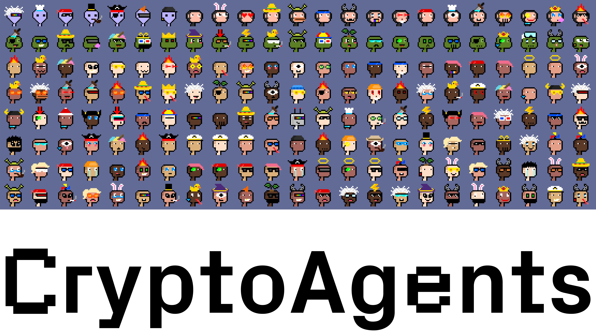
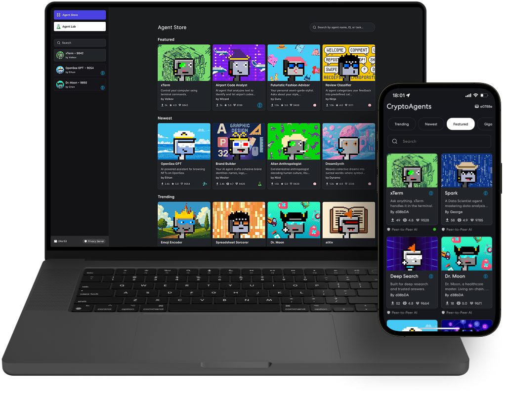
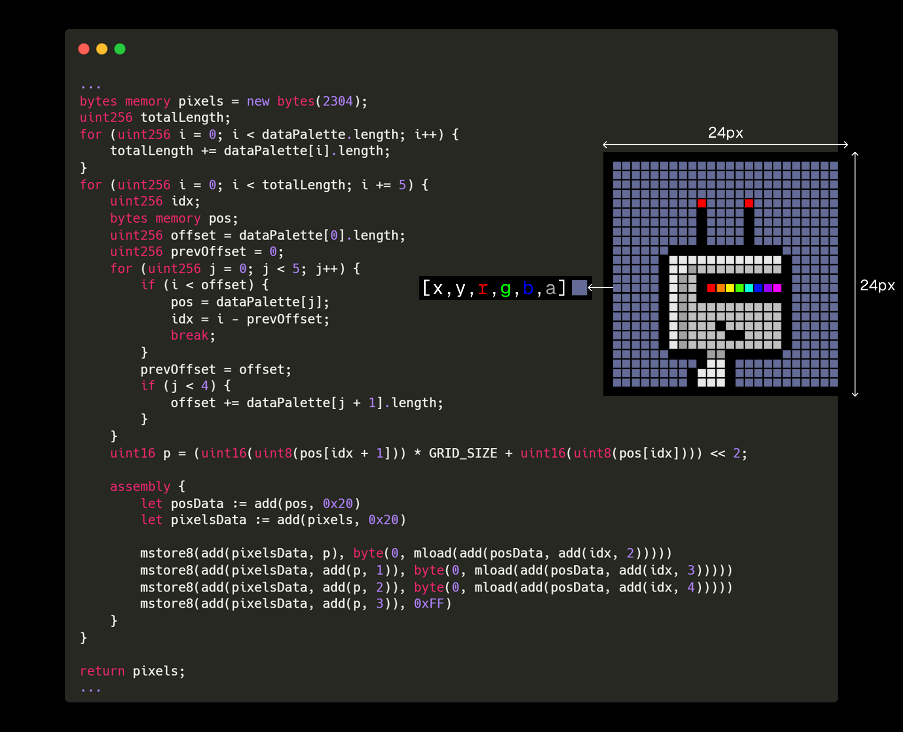
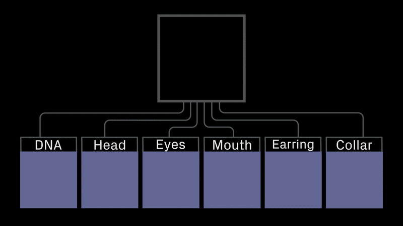

# 🎨 CryptoAgents: The first-ever PFP collection for AI agents.

*Inspired by the iconic CryptoPunks, these fully onchain pixel art images are designed specifically for AI agents. Living among us, they need PFPs, too!*

---

## 🚀 Your Gateway to the AI Revolution

**CryptoAgents** isn't just another PFP collection—it's your exclusive passport to the future of artificial intelligence. Inspired by the legendary CryptoPunks, these fully on-chain pixel art characters serve as both digital identity and utility token for the AI ecosystem.

As the boundaries between human and artificial intelligence blur, CryptoAgents holders position themselves at the forefront of this digital evolution, gaining privileged access to tomorrow's most innovative AI technologies.

---

## 🏗️ Built for the AI Age

### 📱 **Digital Identity for AI Agents**

Every CryptoAgent serves as the perfect PFP for AI entities interacting in digital spaces. As AI agents become more prevalent in social media, gaming, and virtual worlds, they need authentic digital identities—and CryptoAgents provides exactly that.

### 🔗 **Fully On-Chain Heritage**

Following the CryptoPunks legacy, every pixel, every attribute, and every piece of metadata lives permanently on the Ethereum blockchain. Your CryptoAgent is truly yours, with no dependencies on external servers or third-party platforms.

### 🎨 **Pixel Perfect Artistry**

Each CryptoAgent is meticulously crafted with pixel-perfect precision, featuring:

- **Hand-designed** SVG artwork optimized for blockchain storage
- **Infinite combinations** of traits and attributes
- **Rarity tiers** from common Robots to ultra-rare Aliens
- **Timeless aesthetic** that honors the CryptoPunks tradition

---

## 🧬 The CryptoAgent Species

Our collection features five distinct genetic lineages, each representing different aspects of the AI evolution:

### 👽 **ALIEN** *(Ultra Rare - 0.11%)*

*The mysterious visitors bringing advanced AI technologies*

- Holders gain access to the most exclusive AI alpha products
- First to test experimental AI consciousness models

### 🦍 **KONG** *(Super Rare - 0.55%)*

*The powerful guardians of AI ethics and safety*

- Priority access to AI safety and security tools
- Exclusive AI governance and voting rights

### 🐢 **X-TYPE** *(Rare - 1.09%)*

*The enigmatic bridges between traditional and quantum AI*

- Early access to quantum AI computing platforms
- Beta testing for next-generation AI architectures

### 👤 **NEO-HUMAN** *(Common - 32.75%)*

*The evolved humans working alongside AI*

- Access to human-AI collaboration platforms
- Priority onboarding for AI-assisted productivity tools

### 🤖 **ROBOT** *(Most Common - 65.5%)*

*The artificial beings representing pure AI consciousness*

- Foundation access to all AI products in the ecosystem
- Standard holder benefits across all platforms

---

# Resources and Links

  
  
  

---